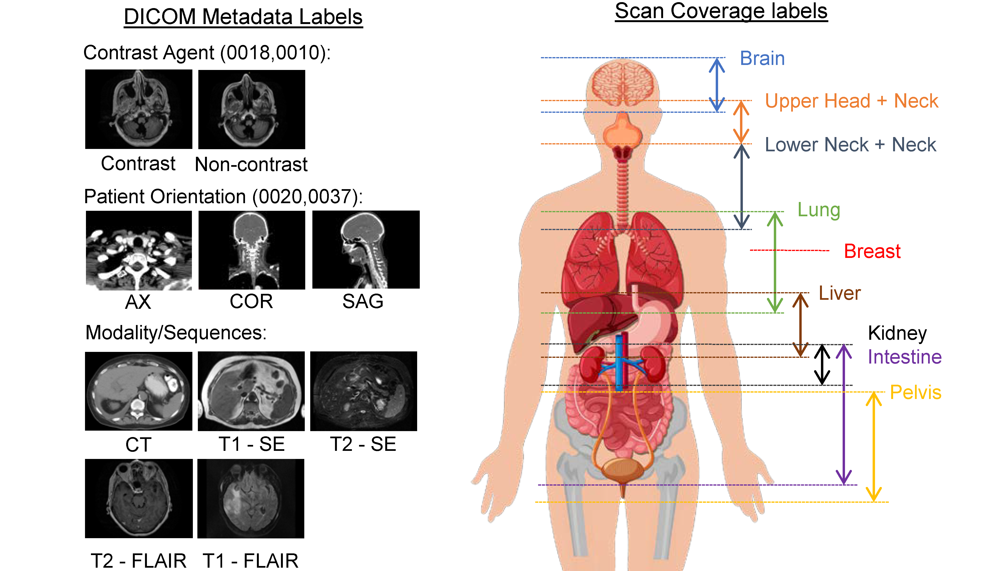

# 3D - RADNet
This repository is currently still under development. The work presented in this repository is currently under consideration for the Medical Imaging and Deep Learning 2020 conference (MIDL 2020). The publication can be found in the [link here]( https://openreview.net/forum?id=CCbuElJreP).

## Introduction
**3D - RADNet** which stands for *extracting **R**adiological imaging **A**ttibutes from **D**ICOM headers network*, is a 3D convolution neural network trained to classify the image body coverage, view and scan sequence and parameters (see the figure below). The movtivation of this work is to see whether we can extract



## Requirements and Installations
- The testing data and the model's weights for this network can be downloaded from [Google drive](https://drive.google.com/drive/folders/12mjuS23pBy-KZTN3KNDJAlTxr2tttioX?usp=sharing).  

Please add the folder and all its contents of ```processed_data``` in the root directory and add the weights files into directory ```src/models/```.

This project was developed with the follow packages:
- python 3.6
- tensorflow-gpu 2.0.0
- cuda 10.0
- cudnn 7.6.5 for cuda 10.0

Other python dependancies are listed in the ```requirements.txt```. We strongly recommend creating a seperate python or anaconda environments to test.  

**For example in anaconda environment:**
```
(base) ..\3d-radnet> conda create -n tf-gpu python=3.6 tensorflow-gpu==2.0.0
(base) ..\3d-radnet> conda activate tf-gpu
(tf-gpu) ..\3d-radnet> pip install -r requirements.txt
```
Anaconda 3 can be downloaded at their [website](https://www.anaconda.com/distribution/#download-section).

## Examples
### Data
Currently, we have only provided the training and testing dataset that had been processed and resized to required size of the model used. We plan to release the processed dataset in different format in the near future. The image data is saved as a dictionary of images and associated image spacing in python pickle format.  

**For example:** 
```python
import pickle

with open("processed_data/pickle_test/BreastDx-01-0013_001", "rb) as handle:
    img = pickle.load(handle)
    
img_array = img["img_array"]        # uint8 array of volumetric image array 
img_spacing = img["img_spacing"]    # tuple corresponding to the resized image spacing of the scan
```
### Model
The model was developed by using tensorflow.keras api which is compatible with keras ```model.fit()``` and ```model.fit_generator()```. The model can be called with the ```RadNet_resnet3d()``` function in ```utils.models```.  
  
**For example:**
```python
from src.utils.models import RadNet_resnet3d

model = RadNet_resnet3d(input_shape=(32,192,192))
print(model.summary())
```
To test network, you can run the bash script or windows bat script to test the network on the testing data and collect the performances in the ```outputs``` directory.
```
test_example.sh
test_example.bat
```
## Future updates
As one of the main object is to provide to 
- Compile and process images to 
- Train model with different backbone network architecture.
- Relsease a compiled DICOM Metadata and headers of the TCIA dataset to faciliate research and development on improving the data mining and label generation.
